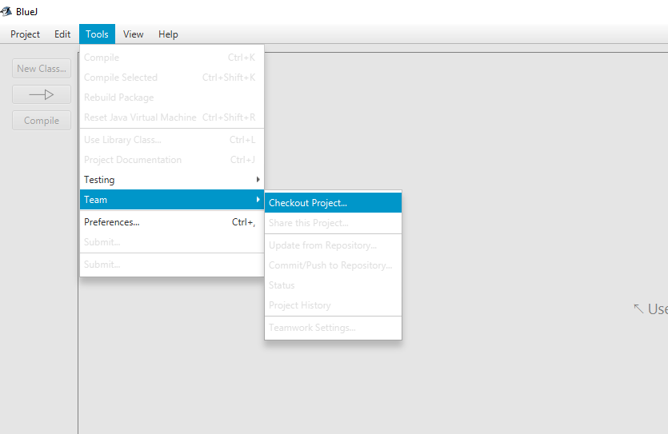
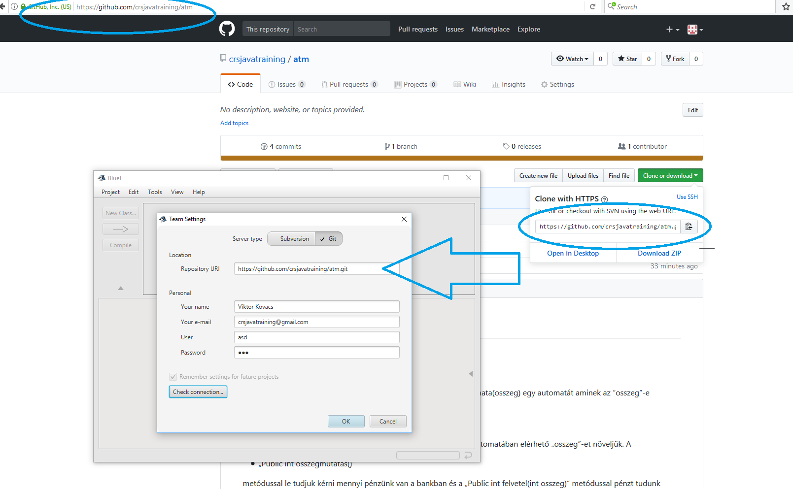
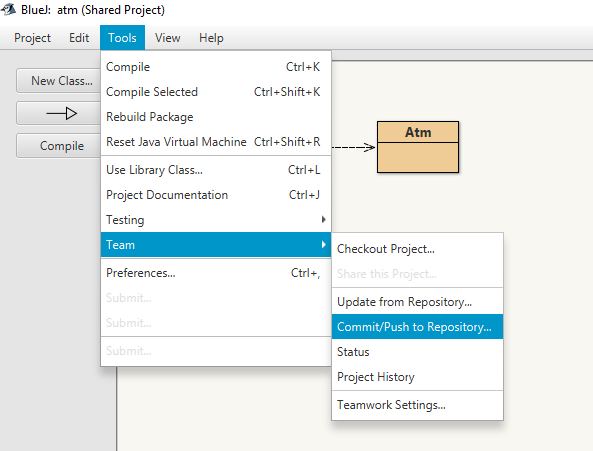
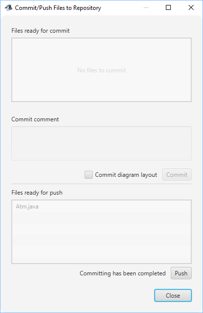

Előismeretek
---

# ATM git repository checkout

A BlueJ rendelkezik git verziókövető supporttal.

Hozz létre egy github accountot:
https://github.com/
(Sign up for github.)

Ha ez megvan akkor a lentebbi képen látható módon lehez klónozni egy git repozitory-t egy távoli szerverről a local gépre.
(Ha a képekre rákattintasz majd megnyomod a download gombot megmutatja a github a képet eredeti méretben)
(Ekkor a teljes github serveren tárolt kód repository tartalom verziótörténettel együtt letöltődik a local gépre.)

A git repository elésére amit clone-ozni kellene:
~~~
https://github.com/crsjavatraining/atm.git
~~~

Ezen felül a BlueJ-ben a képen látható módon szükséges beállítani még 
- email címet (@ kell hogy legyen benne)
- felhasználónevet
- jelszót

Ezeket a mezőket töltsd ki a létrehozott github accountod emailaddress, username, password adataival.
  

Miután a cloneozás megtörtént a BlueJ-ben (továbbiakban: IDE (Integrated Development Environment)) meg fognak jelenni a repositoryban lévő filek.

A feladat az lenne, hogy 
- nézd meg az ATM és TestAtm class-okat
- gyűjtsd össze a kérdéseidet ha vannak
- a TestAtm osztályba megpróbálhatod imlementálni (megvalósítani) a tesztjeit a deposit, withdrawal és showBalance metódusoknak
- Az eredményt próbáld meg commitolni majd pusholni a BlueJ segítségével (tehát a változásaidat visszaküldeni a távoli serverre)

Ehhez kis segítség:

A második képen lévő ablakon
- meg kell adni egy commit üzenetet (tetszőleges szüveg ami leírja hogy mit módosítottál)
- meg kell nyomni a commit gombot (ekkor elmented a módosításokat a local repositorydba)
- meg kell nyomni a push gombot (ekkor felküldöd a módosításodat a távoli serveren lévő repositoryba)