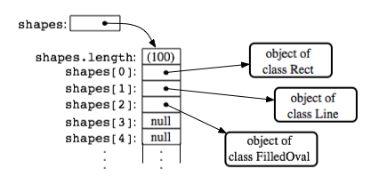

# Access modifiers, ArrayList and reference type comparison

## Access modifiers
https://docs.oracle.com/javase/tutorial/java/javaOO/accesscontrol.html

## Comparing Reference Types
https://www.safaribooksonline.com/library/view/java-pocket-guide/9780596514198/ch04s06.html

## String comparison java
https://stackoverflow.com/questions/513832/how-do-i-compare-strings-in-java

## Array(List) representation in memory:
Ebben a példában tömb (Array) szerepel, de részünkről ez most ugyan olyan mintha ArrayList lenne.
Az ábra bemutatja, hogy a shapes nevű referencia típus rámutat a memóriában egy tömbre. (erre mondtam, h olyan mint egy fiókos szekrény)
Ami tömben indexelve ott vannak az egyes szintén referencia típusok (Rect, Line..)
A tömb minden egyes eleme egy referenciát tartalmaz ami a memóriában rámutat arra a pontra ami a Rect, Line..
típusú objektumok adatait tartalmazza.

Ugyan ezt az ábrát kell akkor is elképzelnes amikor létrehozol egy Tanulok listát amiben tanulók vannak.

~~~
Shape[] shapes = new Shape[100]; // Array to hold up to 100 shapes.
shapes[0] = new Rect();          // Put some objects in the array.
shapes[1] = new Line(); 
shapes[2] = new FilledOval(); 
int shapeCt = 3;  // Keep track of number of objects in array.
~~~
could be illustrated as:

http://math.hws.edu/eck/cs124/javanotes6/c7/s3.html

## ArrayList usage
https://beginnersbook.com/2013/12/java-arraylist/

## Why use getters and setters/accessors? (csak érdekesség)
https://stackoverflow.com/questions/1568091/why-use-getters-and-setters-accessors
